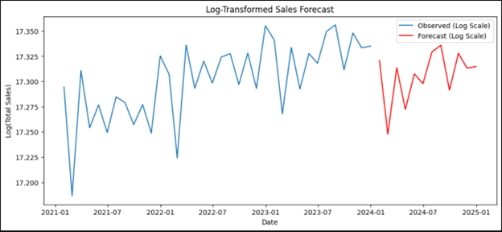

## 📈 Sales Forecasting Using ARIMA (Python)

### 🔍 Overview

This project applies **ARIMA (AutoRegressive Integrated Moving Average)** modeling to forecast future sales based on historical data. The goal is to help businesses anticipate demand and make data-driven inventory and financial decisions.

---

### 🎯 Objectives

* Perform **time series analysis** on sales data.
* Use **ARIMA modeling** to generate reliable sales forecasts.
* Visualize sales trends and predictions using Python libraries.

---

### 📊 Tools & Technologies

* **Python**
* **Pandas**, **NumPy**
* **Matplotlib**, **Seaborn**
* **statsmodels** (for ARIMA)
* **Jupyter Notebook**
* Dataset Source: [Kaggle – Global Superstore Sales](https://www.kaggle.com/)

---

### 📁 Files Included

* `sales_forecasting_arima.ipynb` – Main Jupyter notebook with all steps
* `cleaned_sales_data.csv` – Preprocessed dataset
* `forecast_plot.png` – Forecast visualization
* `README.md` – Documentation

---

### 📈 Key Steps

1. **Data Cleaning & Preprocessing**

   * Handled missing values, aggregated monthly sales.
2. **Stationarity Check**

   * Performed ADF test to verify stationarity.
3. **Model Selection**

   * Chose optimal (p,d,q) parameters using ACF, PACF, and auto\_arima.
4. **Model Fitting**

   * Trained ARIMA model and validated performance.
5. **Forecasting**

   * Generated next 6–12 months of sales predictions with confidence intervals.
6. **Visualization**

   * Plotted actual vs predicted sales.

---

### 📌 Key Insights

* Seasonality and trends were observed in historical sales data.
* ARIMA provided reasonably accurate forecasts with low residual errors.
* Forecast supports proactive decision-making for stock and staffing needs.

---

### ✅ Skills Demonstrated

* Time Series Analysis
* ARIMA Modeling
* Data Cleaning & Visualization
* Forecasting Techniques
* Business-Oriented Insight Generation

---

### 🖼️ Sample Output

---

### 📬 Connect with Me

* 💼 [LinkedIn](https://www.linkedin.com/in/faizanfarid-malek-3b1265313)
* 📧 Email: [faizex07@gmail.com](mailto:faizex07@gmail.com)
* 🧠 Portfolio: [GitHub Portfolio](https://github.com/faizan97-malek)
